## Azure Bootcamp ##
##### Humberto Jaimes - humberto@humbertojaimes.net
##### Saturnino Pimentel - [@saturpimentel](https://twitter.com/saturpimentel)
# Creando y consumiendo Azure Functions

A lo largo de este laboratorio crearemos un par de Azure Functions las cuales consumiremos desde una aplicación Xamarin.Forms

## Requisitos

- Tener una cuenta Azure activa, puede ser una cuenta gratuita.
- Visual Studio 15.3 o superior
  - Xamarin
  - Workload de Azure
  - Extension de functions y web job tools
  

## Creando y configurando los servicios en Azure

1. Crea un nuevo grupo de recursos en Azure llamado "**AzureBootcamp-rg**"

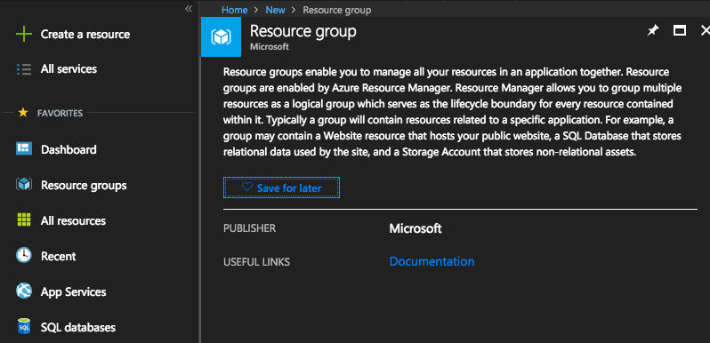

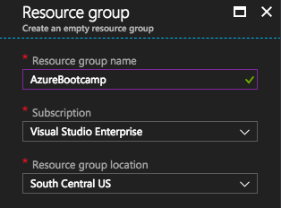

2. Crea un recurso de tipo "**Computer Vision  API**" y al igual que en el caso anterior agrégalo al grupo de recursos **AzureBootcamp-rg**. Nómbralo "**azurebootcamp(tus iniciales)vis**"

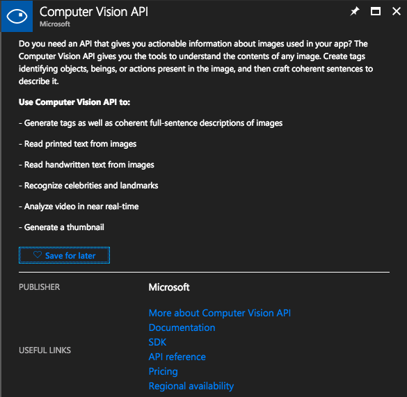

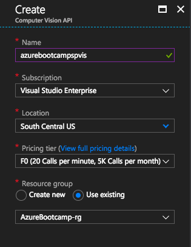

## Creando nuestra Azure Function App

Microsoft nos permite utilizar el enfoque Serverless al correr nuestro código personalizado en **Azure Functions** respondiendo a eventos algo que también es conocido como **Functions as a Service**.

1. Como primer paso crearemos nuestro proyecto de **Azure Functions** para esto genera una nueva solución y selecciona el tipo de proyecto **Azure Function**.

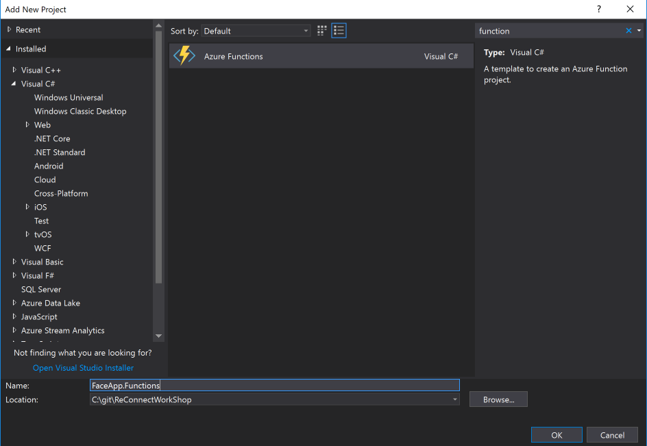

### Creando primer función para análisis de datos

1. Crearemos una clase **FaceRectangle** que herede de la clase **TableEntity** que nos servirá primero para obtener los metadatos de la imagen que enviamos a Computer Vision y después para almacenar información en nuestro table storage después del análisis de las imágenes.
```
public class FaceRectangle : TableEntity
    {
        public string ImageFile { get; set; }

        public int Left { get; set; }

        public int Top { get; set; }

        public int Width { get; set; }

        public int Height { get; set; }

        public int Age { get; set; }

        public string Gender { get; set; }
    }
```
2. Crearemos la clase **Face** que nos servirá para almacenar la información de cada una de las caras que son encontradas por el API de Computer Vision.

```
public class Face
    {
        public int Age { get; set; }

        public string Gender { get; set; }

        public FaceRectangle FaceRectangle { get; set; }
    }
```
3. Ahora crearemos la clase **ImageData** que contiene la información de todos los rostros que fueron detectados durante el análisis.

```
 public class ImageData
    {
        public List<Face> Faces { get; set; }
    }
```

4. Ahora crearemos nuestra primer función con la ayuda de Visual Studio.

4.1 Da click derecho en el proyecto y selecciona **Add**, después selecciona **New Azure Function**.

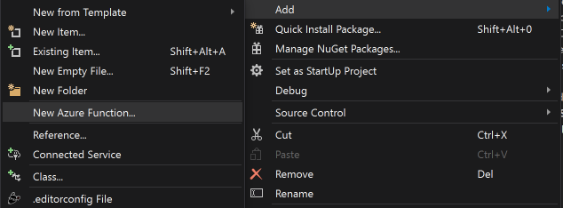

4.2 Agrega el nombre **AnalizeFaceFunction** y presiona **Add**.

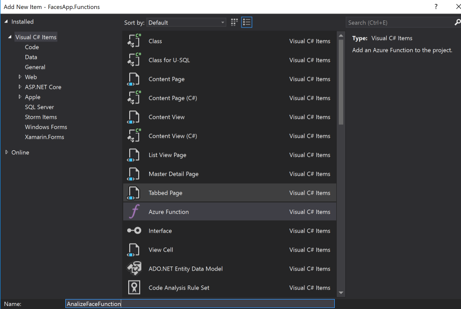

4.3 Visual Studio te mostrará un asistente en el que podrás seleccionar el tipo de Trigger que utilizarás selecciona el **Blob Trigger** y en el campo indicado para el path escribe el nombre del 
contenedor del blob.


4.4 En la clase que Visual Studio genera de manera automática agrega los siguientes espacios de nombres.

```
using Microsoft.Azure.WebJobs;
using Microsoft.Azure.WebJobs.Host;
using Newtonsoft.Json;
using System;
using System.IO;
using System.Net;
using System.Net.Http;
using System.Net.Http.Headers;
using System.Threading.Tasks;
```

4.5 También agrega el siguiente código a tu función el cuál enviará tu imagen al API de Computer Vision y guardará los resultados en un **Table Storage** utilizando las clases que anteriormente creamos.

```
public static class AnalizeFaceFunction
    {
        private static string _url = "https://southcentralus.api.cognitive.microsoft.com/vision/v1.0/analyze?visualFeatures=Faces&language=en";

        [FunctionName(nameof(AnalizeFaceFunction))]
        public static async Task Run(
            [BlobTrigger("facescontainer/{name}.png", Connection = "")]Stream image,
            string name,
            [Table("facestable", Connection = "")] IAsyncCollector<FaceRectangle> outTable,
            TraceWriter log)
        {
            string apiResult = await CallVisionApiAsync(image, log);
            log.Info($"Resultado de la operación: {apiResult}");

            if (!string.IsNullOrEmpty(apiResult))
            {
                ImageData imageData = JsonConvert.DeserializeObject<ImageData>(apiResult);
                log.Info($"imagenes:{imageData}");
                foreach (Face face in imageData.Faces)
                {
                    FaceRectangle faceRectangle = face.FaceRectangle;
                    faceRectangle.RowKey = Guid.NewGuid().ToString();
                    faceRectangle.PartitionKey = "AzureBootCamp";
                    faceRectangle.ImageFile = name + ".png";
                    faceRectangle.Age = face.Age;
                    faceRectangle.Gender = face.Gender;
                    await outTable.AddAsync(faceRectangle);
                }
            }
        }

        private static async Task<string> CallVisionApiAsync(Stream image, TraceWriter log)
        {
            using (HttpClient client = new HttpClient())
            {
                StreamContent content = new StreamContent(image);

                client.DefaultRequestHeaders.Add("Ocp-Apim-Subscription-Key", Environment.GetEnvironmentVariable("Vision_API_Subscription_Key"));
                content.Headers.ContentType = new MediaTypeHeaderValue("application/octet-stream");
                HttpResponseMessage httpResponse = await client.PostAsync(_url, content);

                log.Info($"Estatus code {httpResponse.StatusCode}");
                log.Info($"Content {await httpResponse.Content.ReadAsStringAsync()}");
                if (httpResponse.StatusCode == HttpStatusCode.OK)
                {
                    return await httpResponse.Content.ReadAsStringAsync();
                }
            }
            return null;
        }
    }
```
> Nota: Revisa el archivo **local.settings.json** y valida que tiene los siguientes datos.

```
{
    "IsEncrypted": false,
  "Values": {
    "AzureWebJobsStorage": "UseDevelopmentStorage=true",
    "AzureWebJobsDashboard": "UseDevelopmentStorage=true",
    "Vision_API_Subscription_Key": "llave"
  }
}
```

### Creando una segunda función para exponer los datos

1. En este paso agregaremos una función que nos permita consultar los registros de nuestro table storage.

1.1 Da click derecho en el proyecto y selecciona **Add**, después selecciona **New Azure Function**.


1.2 Agrega el nombre **GetFacesFuntion** y da click en **Add**.

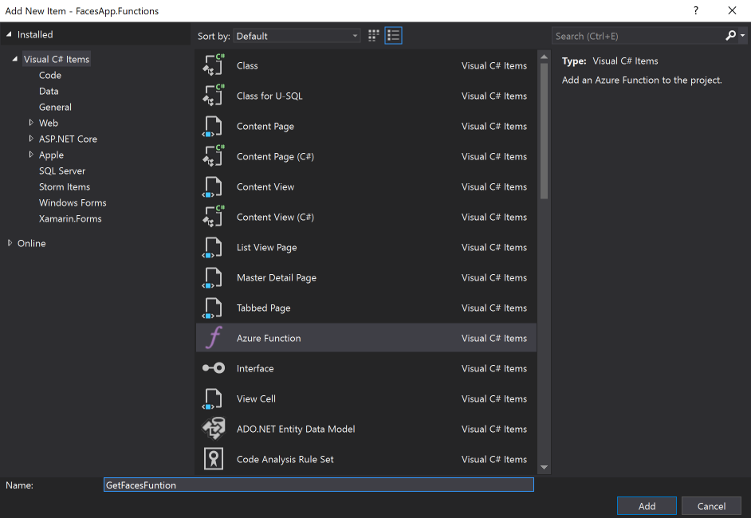

1.3 Agrega las siguientes referencias.

```
using Microsoft.Azure.WebJobs;
using Microsoft.Azure.WebJobs.Extensions.Http;
using Microsoft.Azure.WebJobs.Host;
using System.Linq;
using System.Net;
using System.Net.Http;
```

1.4 Ahora cambia el código de la clase por el que se muestra a continuación.

```
public static class GetFacesFuntion
    {
        [FunctionName(nameof(GetFacesFuntion))]
        public static HttpResponseMessage Run(
            [HttpTrigger(AuthorizationLevel.Function, "get", Route = null)]HttpRequestMessage req,
            [Table("facestable", "AzureBootCamp")]IQueryable<FaceRectangle> table,
            TraceWriter log)
        {
            return req.CreateResponse(HttpStatusCode.OK, table.ToList());
        }
    }
```

## Publicando nuestras funciones a Azure con Visual Studio

En este punto hemos creado nuestras funciones, ahora podemos realizar el proceso de publicación desde **Visual Studio**.

1. Da click derecho en el proyecto y selecciona **Publish**
 
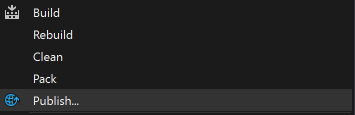

2. Visual Studio te presentará la siguiente pantalla, por favor selecciona **Create New**.

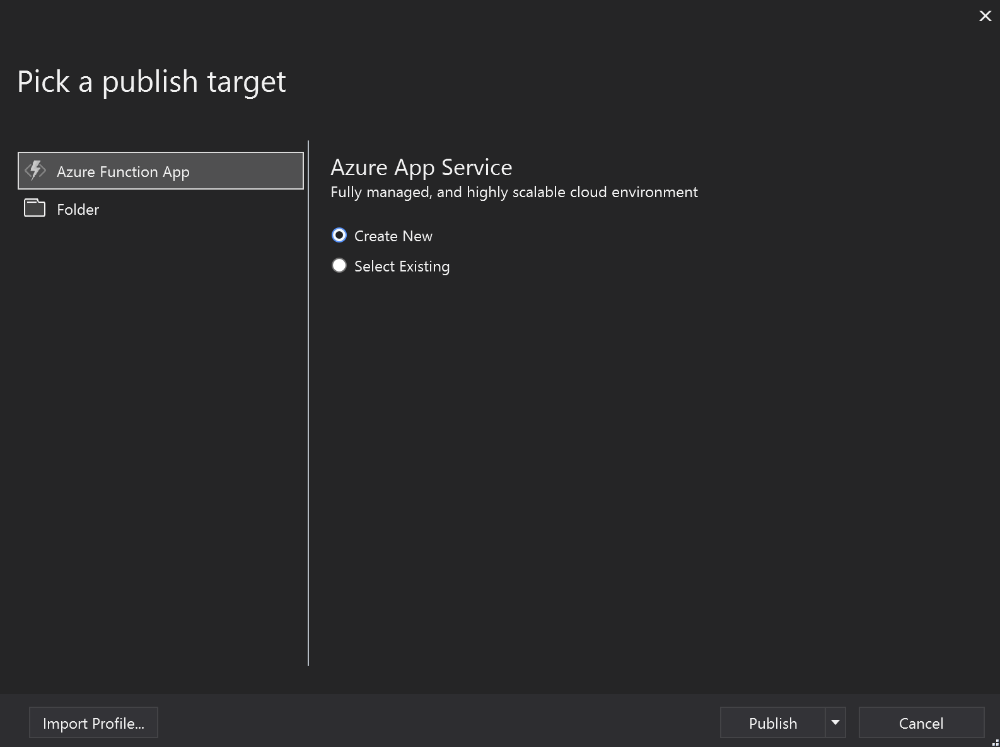

3. Ahora agrega los datos que te solicita el formulario de publicación (si es necesario agrega tus iniciales al final para evitar conflictos).

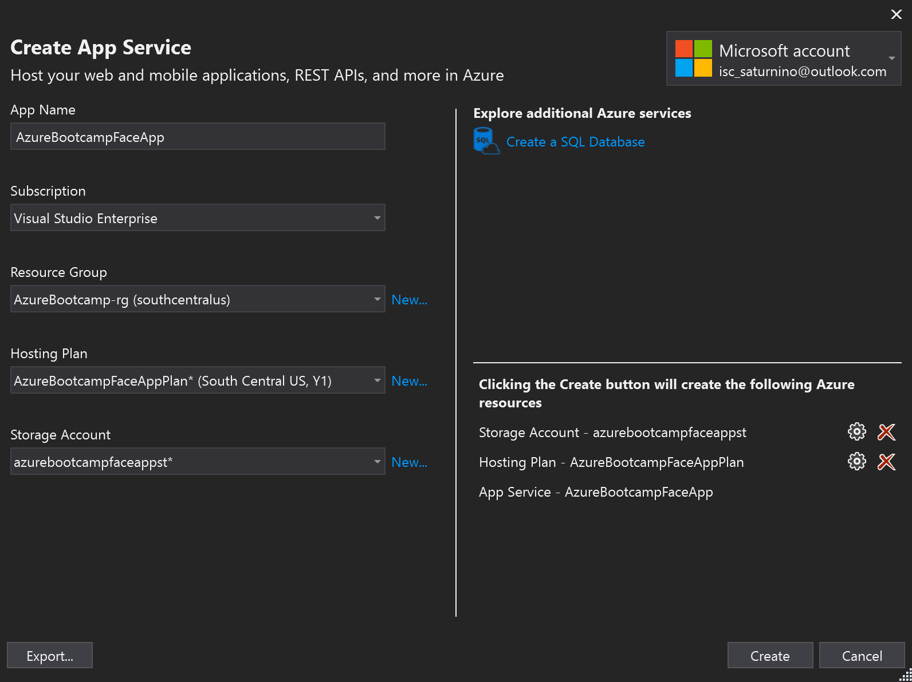

4. Al presionar el botón **Create** Visual Studio comenzará el proceso de creación de los recursos y publicación de nuestras funciones.

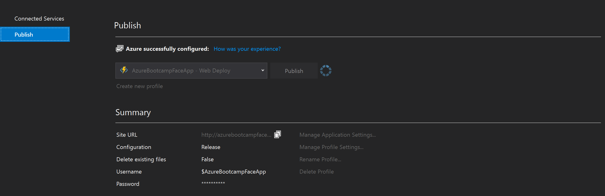

5. Al terminar el proceso de publicación selecciona la opción **Manage Application Settings** y agrega el application setting **Vision_API_Subscription_Key** con la llave que te proporcione el servicio de **Computer Vision** que hemos creado anteriormente.

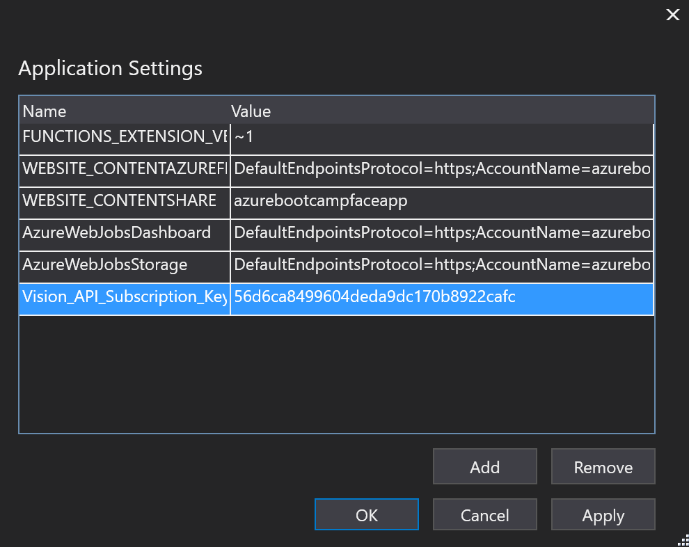


## Probando nuestras Azure Functions con una app Xamarin

1. Clona el proyecto [ReConnectWorkShop](https://github.com/SaturninoPimentel/ReConnectWorkShop).
Este proyecto permite subir una imagen al blob storage y consumir la información del análisis de **Computer Vision API**.
Para poder probar la aplicación agrega los datos que se solicitan en el proyecto en la clase **Constants**.
 

```

    public class Constants
    {
        public const string StorageEndPoint = "";
        public const string BlobStorageUrl = "";
        public const string ContainerName = "";
        public const string PersonApiUrl = "";
    }

```

1.1 Copia y pega la cadena de conexión del storage en el campo **StorageEndPoint**.

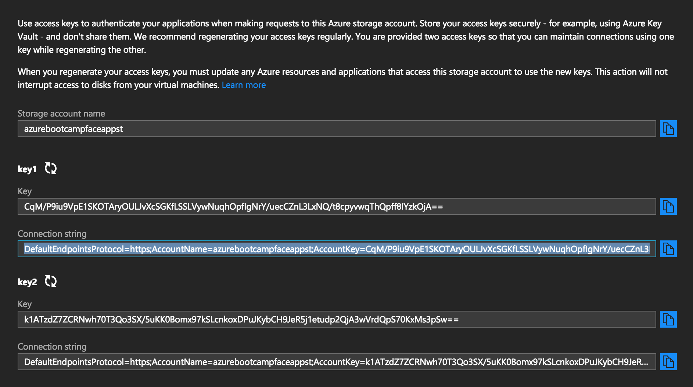

1.2 Copia y pega la url del blob storage que creamos anteriormente en el campo **BlobStorageUrl**. También copia y pega el nombre del contenedor en el campo **ContainerName**.

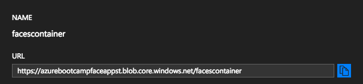

1.3 Copia y pega la url de la función **AnalizeFaceFunction** en el campo **PersonApiUrl**.


1.4 Ahora ejecuta la aplicación y prueba el flujo de la misma.

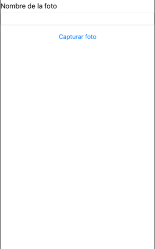
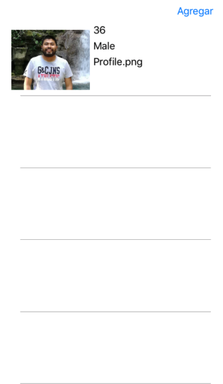


